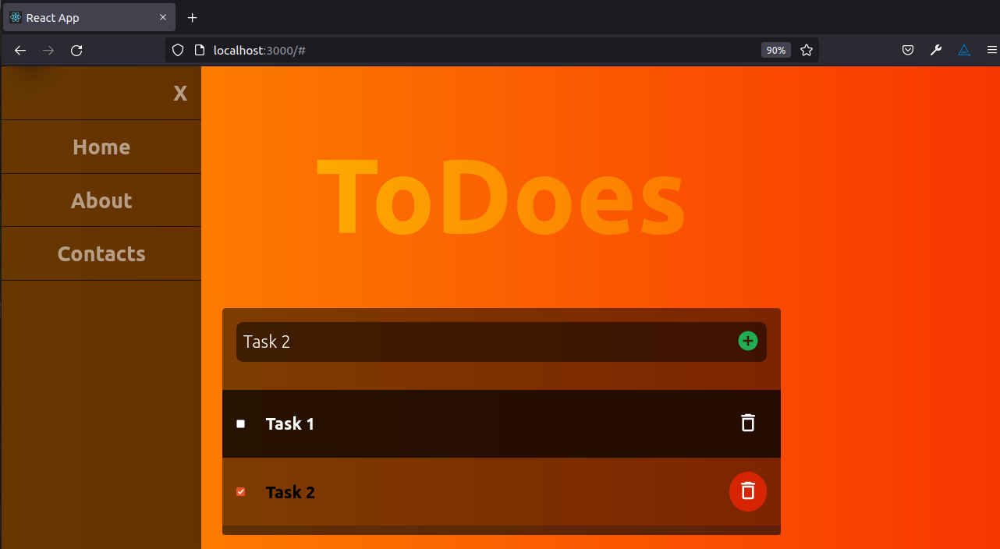

# ToDoes React App

> Simple app to create a to-do list for day built with React.

ToDoes assist you in creating list of tasks for the day, you can add task, mark them completed and also delete completed tasks. The app has been built with React within the microverse curriculum

## Built With

- HTML/CSS JS
- React
- GitFlow

## Live Demo

[Live Demo Link](https://livedemo.com)

## Getting Started

To get a local copy up and running follow these simple example steps.

### Prerequisites

Install or update on your local terminal the node.js package.

### Setup

To get a local copy up and running follow these simple steps.

To setup the todoes-react project in your local, in the repo page:
click on code (dropdown list) > Download as ZIP;
or open terminal of path you want to install project and run this command  
`git clone git@github.com:Hope1226/Todoes-react-app.git`

### Install

Run in your terminal the following commands:

**`$ cd todoes-react-app/`** 
**`$ npm install`** 
**`$ npm run build`** 
**`$ npm start`**

## Authors

👤 **Umidjon Ustabaev (Hope)**

- GitHub: [@githubhandle](https://github.com/Hope1226)
- LinkedIn: [LinkedIn](https://www.linkedin.com/in/umidjon-ustabaev-03b92b11a/)

## 🤝 Contributing

Contributions, issues, and feature requests are welcome!

Feel free to check the [issues page](../../issues/).

## Show your support

Give a ⭐️ if you like this project!

## Acknowledgments

- Hat tip to anyone whose code was used
- Inspiration
- etc

## 📝 License

This project is [MIT](./MIT.md) licensed.